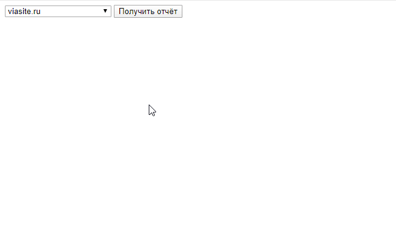

Веб-сервис для быстрого получения нужных данных по сайту из Яндекс.Метрики.

Использует пакет [nixsolutions/yandex-php-library](https://github.com/nixsolutions/yandex-php-library).

Предполагается использование как дополнение к Excel:

- Получаем данные из сервиса
- Вставляем данные в лист Excel
- В соседнем листе настраиваем красивый отчёт

## Установка
1. `git clone https://github.com/viasite/yandex-metrika && cd yandex-metrika && composer install`
2. Настроить веб-сервер на корень сервиса - `public`.
3. Создать приложение на https://oauth.yandex.ru/ , дать ему права на чтение Метрики.
4. Перейти на https://oauth.yandex.ru/authorize?response_type=token&client_id=your_app_client_id, получить токен.
5. Скопировать `config.example.php` в `config.php`, добавить туда токен.

## Возможности
### Отчёты со сравнением последнего месяца и этого же месяца год назад:
- Источники
- Поисковики
- Устройства
- Глубина просмотра
- Возраст
- Пол

### Отчёты по целям:
- Цели по источникам
- Цели по устройствам